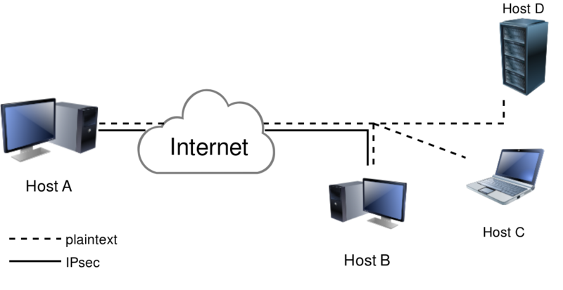

# 主机到主机

图里画了两个主机间的IPSec连接的例子。下来讲下如何创建这种VPN。<p/>
先定义几个术语，使用术语```left```表示图中左边或者"西"边的endpoint，而用```right```表示图中右边或者"东"边的endpoint。
同时使用```RSA```而不是```pre shared keys (PSK)```，因为RSA更安全更简单
## 创建vpn配置
1. 在每个endpoint上生成RSA，然后打出key，写入我们的配置文件。注意展示key的时候要去掉多余的空格，让格式紧缩。例如用下面的方法<p/>
在一个节点上运行
```shell
[root@west ~]# ipsec newhostkey 
Generated RSA key pair with CKAID f8d0e8766b60eaf5a10d2a220955bb1688415e6e was stored in the NSS database
[root@west ~]# ipsec showhostkey --left --ckaid f8d0e8766b60eaf5a10d2a220955bb1688415e6e
	# rsakey AwEAAb42X
	leftrsasigkey=0sAwEAAb42X0gw [....]
```
* 需要预先安装ipsec <p/>
然后在另一个节点上运行
```shell
[root@east ~]# ipsec newhostkey
Generated RSA key pair with CKAID b95477d03cbe3118c50fb433a2740ec52f3fb2d8 was stored in the NSS database
[root@east ~]# ipsec showhostkey --right --ckaid b95477d03cbe3118c50fb433a2740ec52f3fb2d8
	# rsakey AwEAAesFf
	rightrsasigkey=0sAwEAAesFfVZqFzRA9F [...]
```
* 嵌入式硬件这种低端设备上，生成RSA的过程可能需要几分钟
* 在老版本的libreswan上，newhostkey命令需要使用"--output /etc/ipsec.d/your.secret"，并且主密钥文件/etc/ipsec.secrets需要include
* 声明/etc/ipsec.d/*.secret。当前libreswan版本的密钥文件只用于PSK和XAUTH的密码。

上面生成了left和right的RSA，现在需要编辑/etc/ipsec.conf，生成的这份配置文件在left、right机器上都可以用
```shell
# /etc/ipsec.conf
conn mytunnel # 这里的mytunnel可以随意写
    leftid=@west # 似乎这里的id也可以随意写
    left=192.1.2.23 # 要和left的vpn地址相同
    leftrsasigkey=0sAwEAAb42X0gw [....] # 要和left查出来的真实publicKey相同
    rightid=@east # 似乎这里的id也可以随意写
    right=192.1.2.45 # 要和right的vpn地址相同
    rightrsasigkey=0sAwEAAesFfVZqFzRA9F # 要和right查出来的真实publicKey相同
    authby=rsasig # 固定值
    # use auto=start when done testing the tunnel
    auto=add
```
## 启动vpn
把/etc/ipsec.conf复制到left和right机器，并保证systemctl status ipsec查看是active的，然后加载配置
```shell
ipsec auto --add mytunnel # 注意mytunnel是和/etc/ipsec.conf里的conn名字一致的
```
启动tunnel
```shell
ipsec auto --up mytunnel
```
如果启动正常，看起来会是
```shell
ipsec auto --up  mytunnel
002 "mytunnel" #1: initiating v2 parent SA 
1v2 "mytunnel" #1: initiate 
1v2 "mytunnel" #1: STATE_PARENT_I1: sent v2I1, expected v2R1
1v2 "mytunnel" #2: STATE_PARENT_I2: sent v2I2, expected v2R2 {auth=IKEv2 cipher=AES_GCM_16_256 integ=n/a prf=HMAC_SHA2_512 group=MODP2048}
002 "mytunnel" #2: IKEv2 mode peer ID is ID_FQDN: '@east'
003 "mytunnel" #2: Authenticated using RSA
002 "mytunnel" #2: negotiated connection [192.1.2.45-192.1.2.45:0-65535 0] -> [192.1.2.23-192.1.2.23:0-65535 0]
004 "mytunnel" #2: STATE_V2_IPSEC_I: IPsec SA established tunnel mode {ESP=>0xESPESP <0xESPESP xfrm=AES_GCM_16_256-NONE NATOA=none NATD=none DPD=passive} 
```
后续想让机器启动的时候自动启动tunnel，把配置中的"auto=add" 改为 "auto=start"（当然需要把IPSec加入到systemctl启动列表中）
## 验证
通过ping发几个包，然后用```ipsec trafficstatus```查看传输
```shell
[root@west ~]#  ping -n -c 4 192.1.2.23
PING 192.1.2.23 (192.1.2.23) 56(84) bytes of data.
64 bytes from 192.1.2.23: icmp_seq=1 ttl=64 time=0.443 ms
64 bytes from 192.1.2.23: icmp_seq=2 ttl=64 time=0.403 ms
64 bytes from 192.1.2.23: icmp_seq=3 ttl=64 time=0.450 ms
64 bytes from 192.1.2.23: icmp_seq=4 ttl=64 time=0.437 ms
--- 192.1.2.23 ping statistics ---
4 packets transmitted, 4 received, 0% packet loss, time 3028ms
rtt min/avg/max/mdev = 0.403/0.433/0.450/0.023 ms
[root@west ~]# ipsec trafficstatus
006 #2: "westnet-eastnet-ipv4-psk-ikev2", type=ESP, add_time=1561671961, inBytes=336, outBytes=336, id='@east'
```

# 后记
这里验证的是传输加密，而对并网络联通性没有帮助。即网络连通性并不由liberswan负责